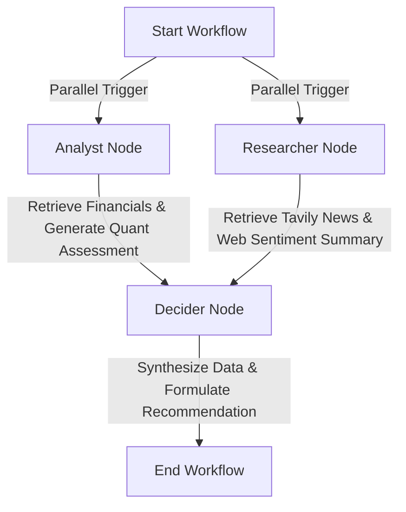

# Invenio: AI Investment Research Agent

Invenio is a professional, institutional-grade AI-powered Equity Research Agent. It automates financial modeling, web/news research, and investment thesis compilation for a given stock ticker based on custom investment horizons and risk tolerance profiles.

Built using **Next.js (App Router)**, **TypeScript**, **Tailwind CSS**, **LangGraph.js**, **Yahoo Finance**, and **Tavily Search**, Invenio implements an agentic design pattern that models a hedge fund's investment committee workflow.

## Key Features
- **Parallel Research Execution**: Leverages LangGraph to execute quantitative financial statement parsing and qualitative news sentiment gathering in parallel, optimizing API response times.
- **Quantitative Engine**: Direct integration with Yahoo Finance to pull stock quotes, key metrics (PE ratio, EPS, Beta, Market Cap), and financial statements (Total Revenue, Net Income, Operating/Free Cash Flow, Return on Equity, Debt-to-Equity, and Current/Quick ratios).
- **Qualitative News & Web Engine**: Integrated Tavily search to fetch and synthesize sector trends, competitor footprints, macro headwinds, and recent news events.
- **Multi-LLM Support**: Supports both **Google Gemini** (via `@langchain/google-genai`) and **OpenAI** (via `@langchain/openai`), toggleable via environment variables.
- **Structured Synthesis (Decider Node)**: Synthesizes both quantitative and qualitative reports into a structured hedge fund recommendation (`BUY`, `HOLD`, or `SELL`) alongside confidence scores, SWOT lists (pros/cons), risk factors, catalysts, and a target price.
- **Collapsible Execution Logs**: Collapsible terminal-style interface allowing users to inspect the agent's step-by-step thought process in real-time.

---

## Agentic Architecture Flow (LangGraph)

The research agent executes a 3-stage StateGraph compiled via LangGraph:



1. **Analyst Node**: Fetches quantitative stock information and key statements via `yahoo-finance2`. It generates a quantitative health assessment.
2. **Researcher Node**: Executes Tavily queries for news and web research, generating qualitative summaries.
3. **Decider Node**: Inherits state from both nodes, evaluates user profiles (horizon/risk), and uses structured tool calling to produce a formatted recommendation JSON.

---

## Tech Stack
- **Frontend**: Next.js 15 (App Router, Client Components)
- **Styling**: Tailwind CSS (Sleek dark mode / glassmorphism)
- **Agent Orchestration**: LangGraph.js & LangChain.js
- **APIs**:
  - Yahoo Finance (`yahoo-finance2`)
  - Tavily Search REST API (Web & News search)
  - News API (Optional, falls back to Tavily)

---

## Getting Started

### 1. Prerequisites
Ensure you have **Node.js 18.x** or higher installed.

### 2. Clone the Repository
```bash
git clone https://github.com/neetka/insideiim-ai-investment-agent.git
cd insideiim-ai-investment-agent
```

### 3. Install Dependencies
```bash
npm install
```

### 4. Configure Environment Variables
Create a `.env` file in the root directory by copying the `.env.example`:
```bash
cp .env.example .env
```

Open `.env` and fill in the required keys:
```env
# Choose between 'gemini' or 'openai'
LLM_PROVIDER=gemini

# Google Gemini API Key (required if LLM_PROVIDER=gemini)
GEMINI_API_KEY=AIzaSy...

# OpenAI API Key (required if LLM_PROVIDER=openai)
OPENAI_API_KEY=sk-...

# Tavily API Key (Required for news & competitive web research)
TAVILY_API_KEY=tvly-...

# News API Key (Optional, falls back to Tavily News topic if empty)
NEWS_API_KEY=
```

### 5. Run the Development Server
```bash
npm run dev
```
Open [http://localhost:3000](http://localhost:3000) in your browser to view the application.

---

## API Documentation

### POST `/api/research`
Triggers the LangGraph agent workflow for a given stock ticker.

**Request Body:**
```json
{
  "ticker": "NVDA",
  "horizon": "medium",
  "riskProfile": "high"
}
```

- `ticker` (string, required): Standard stock ticker symbol.
- `horizon` (string, required): Choice of `short` (<1yr), `medium` (1-3yrs), or `long` (>3yrs).
- `riskProfile` (string, required): Choice of `low` (preservation), `medium` (balanced), or `high` (aggressive).

**Response Payload (200 OK):**
```json
{
  "success": true,
  "recommendation": {
    "ticker": "NVDA",
    "companyName": "NVIDIA Corporation",
    "action": "BUY",
    "currentPrice": 128.20,
    "targetPrice": "$150.00",
    "confidence": 85,
    "thesis": "Detailed investment thesis connecting AI hardware demand...",
    "pros": ["Monopoly in AI accelerators", "High ROE", "Strong cash flow margins"],
    "cons": ["High valuation multiple", "Supply chain concentration", "Geopolitical risks"],
    "risks": ["TSMC disruptions", "Hyperscaler custom silicon chips"],
    "catalysts": ["Next-gen Blackwell chip shipment reports", "Quarterly earnings beat"],
    "financialAssessment": "Consolidated financial performance remains strong with over 50% operating margins..."
  },
  "financials": { ... },
  "webResearch": "...",
  "newsResearch": "...",
  "logs": [
    "[API] Triggering workflow for NVDA...",
    "[Analyst] Initiating financial analysis...",
    "[Researcher] Querying Tavily news...",
    "[Decider] Synthesizing investment recommendation..."
  ]
}
```

---

## Vercel Deployment

Invenio is ready to deploy on **Vercel** with a single click.

### Key Deployment Note
Because the agent queries multiple external APIs (Yahoo Finance, Tavily) and triggers sequential LLM calls, the execution time often exceeds Vercel's default 10-second serverless function timeout.

To prevent timeout failures, the API route is pre-configured with:
```typescript
export const maxDuration = 60; // Configures Vercel function timeout to 60s
```
Ensure you add all API environment variables (`GEMINI_API_KEY`, `TAVILY_API_KEY`, etc.) inside the Vercel project settings dashboard before launching.
